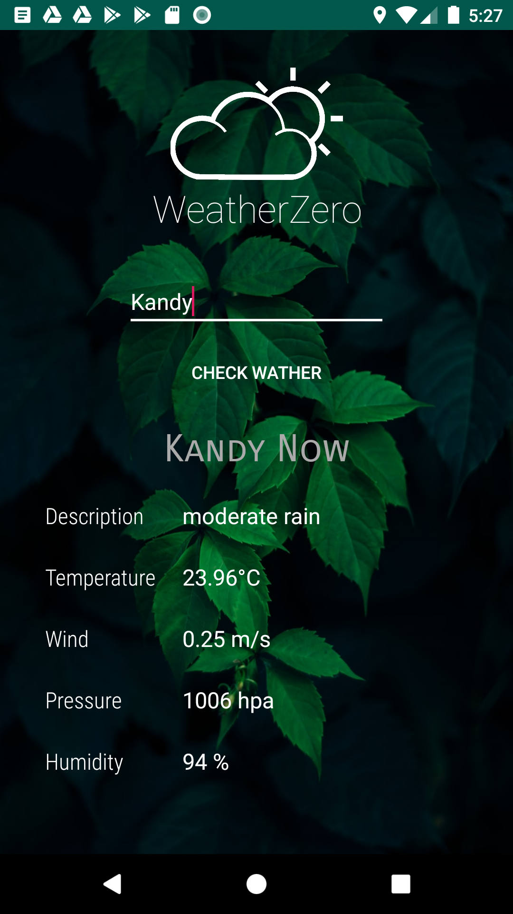

# android_weather_app
Hello. This is a simple android weather app. You can use the given text field to give your location and get the weather details 

You can learn 
 - How to use AsyncTask to do downloads in background
 - How to use HttpsURLConnection, InputStream and InputStreamReader to open connection and get data from web
 - How to use JSON objects and read data from it
 
This app I used [openweathermap](https://openweathermap.org/) site to get weather data. They have a well documented API [here](https://openweathermap.org/api)

Feel free to change this app and use in your own applications. 

Thank you

I used [unsplash](https://unsplash.com/) to download the background image.

[Oreo Development Course](https://www.udemy.com/share/101Y5MAkMcdl5bRXo=/)
